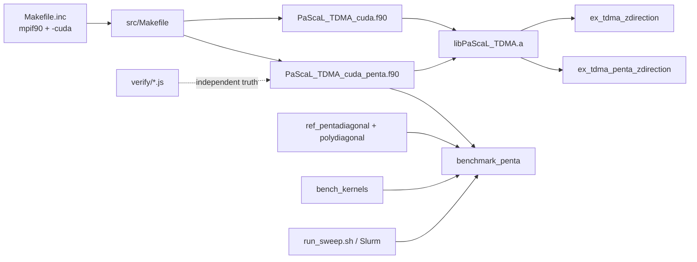
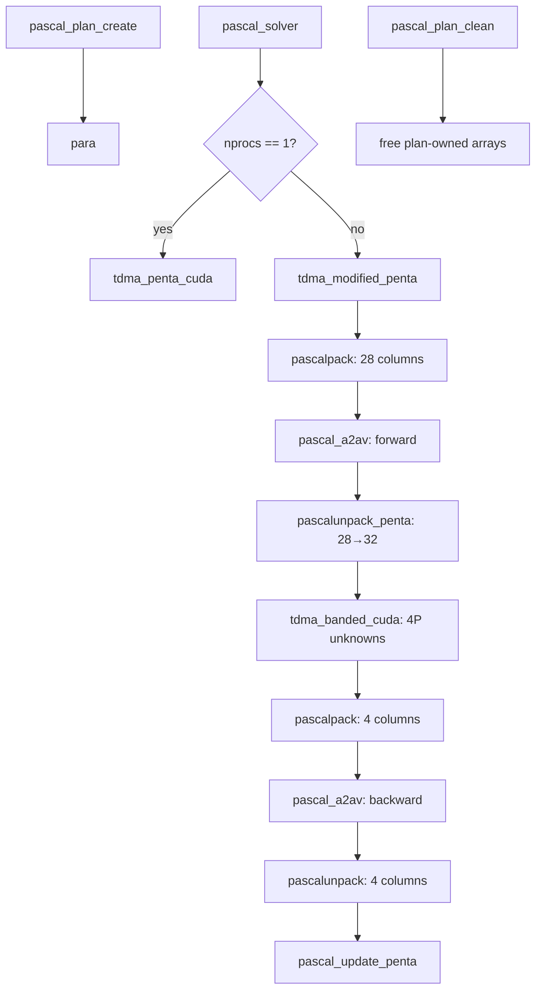

# 模块依赖与构建地图

## 结论

仓库由两个求解器模块、两个示例、独立 Node 数学验证、五对角 benchmark 和 HPC 脚本构成。主库与 benchmark 的构建路径不同：主库把三/五对角对象打进同一静态库，benchmark 则直接编译五对角源码并链接独立参考组。

## 主模块

| 模块 | 公共对象/API | 作用 | 主要风险 |
| --- | --- | --- | --- |
| `PaScaL_TDMA_cuda` | `ptdma_plan_cuda`、`pascal_plan_create/solver/clean` | 三对角基线 | TASK-001 代码已修复，待目标 MPI 回归 |
| `PaScaL_TDMA_cuda_penta` | `ptdma_plan_cuda`、`ptdma_timing_cuda`、普通/计时 solver | 五对角研究主实现 | TASK-001 待目标 MPI 回归、输入检查不足、原位覆盖 |

两模块导出同名 plan 类型和 API，但属于不同 Fortran module。调用方必须 `use` 正确模块，不能同时假定两个 `ptdma_plan_cuda` 可互换。

## 五对角函数调用图

`pascal_solver_profiled_penta` 重复同一链路并在阶段间同步计时；生产路径 `pascal_solver` 不应因 benchmark 改动而引入同样的同步开销。

## 构建入口

| 目标 | 命令 | 输出 |
| --- | --- | --- |
| 主库 | `make lib` | `lib/libPaScaL_TDMA.a`、`include/*.mod` |
| 三对角示例 | `make example` | `run/a.out` |
| 五对角示例 | `make penta` | `run/a.out_penta` |
| 全部 | `make all` | 上述全部 |
| benchmark | `make`（在 `perf_bench`） | `perf_bench/benchmark_penta` |
| 数学真值 | `node verify/<script>.js` | 终端通过/失败摘要 |

## 已知构建边界

- Makefile 使用 Unix `mkdir/rm`，应在 Linux/WSL/HPC 执行；
- 需要 NVHPC CUDA Fortran 与兼容 MPI wrapper；
- 当前 Windows PowerShell 未发现 `nvfortran/mpif90/make`；
- 历史 `.o/.mod/.a` 和可执行文件不能替代干净构建；
- benchmark 会重用/覆盖 `src/PaScaL_TDMA_cuda_penta.o`，不同 flags 的增量构建可能混用对象，论文实验应先 clean。

## 变更影响

- 改 plan 布局：主库、五对角示例、benchmark 均需重建；
- 改槽位格式：S1、pack/unpack、描述符、独立验证和 benchmark 全部受影响；
- 改公共 API：示例与任何外部 CFD 调用方受影响；
- 改计时类型：benchmark CSV 字段映射受影响。

## 相关

- [[data-ownership-and-lifetime]]
- [[build-and-runtime-map]]
- [[../methods/six-stage-penta-flow]]
- [[../testing/test-matrix]]
